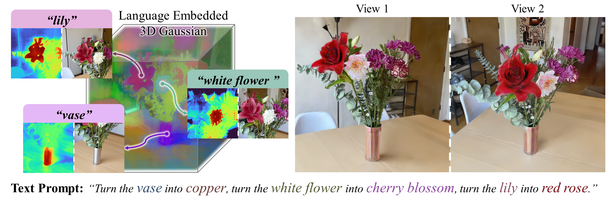

# TIGER: Text-Instructed 3D Gaussian Retrieval and Coherent Editing
Thanks to GaussianDreamer: Fast Generation from Text to 3D Gaussians by Bridging 2D and 3D Diffusion Models for the source code. This repository is implemented based on it.
What this repository provides now is editing related code.
